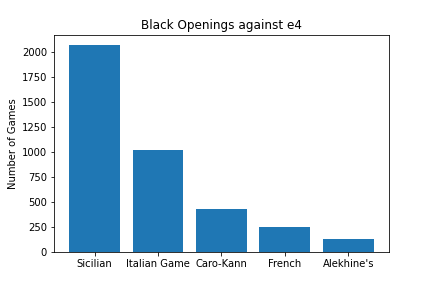
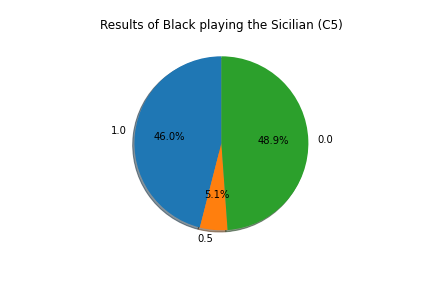

# The Chess Analysis Program

This code fetchs user chess data from chess.com, and prints out statistical visualization of the user's data.

The graphs show several points of analysis including win/draw/loss by time of day, rating progression over time (overlayed with time controls), and opening choices, both for white and black, and the respective results. There are currently 19 output graphs, and the ability to create several more.

## The Results

#### User results by time of day

#### User time of day vs date played

#### User as white first move

#### User as black against e4

#### User percentage as black playing the sicilian

  
## Information collected: 
  
> * Date, and Time of Day played
> * White Player Name, White Rating, and White Result
> * Black Name, Black Rating, and Black Result
> * Eco Name (refers to the opening moves), and Eco Code (same)
> * URL, and PGN score (chess notation)

## Analysis Found

- I play much better at night. 
- I score better as black playing less popular Caro-Kann and French defense, compared to both the mainline Italian and Sicilian games.
- My friend Dirtisox almost exclusively plays 1. Nf3 
- My friend HaydnOpus20 almost exclusively answers 1.e4 with the daring 1 ... Nf6 (Alekhine's defense)

## Technical Explanation

_Please make sure to make your own config.py file with the following format: login = ("username:password")._ \
_You should have PostgresSQL installed in your computer, and you might need to create a database named chess_db._

Run all cells in "chess_df_and_graphs.ipynb. You are prompted to input the username. After several moments, the relevant graphs save to graphs/{username}. The created dataframe saves to csv_files/{username}.csv.

Python makes a series of API calls to the chess.com website with the username. The code receives a list of archived months in url format. This list contains every month the user has played a chess game on chess.com.
  
The list of archived months is used to loop through the master archive to collect the games. This came in a complex, unsegmented json response (actually a tab delimited dataset). I wrote the code to parse through the json response for the appropriate data and format. I then combined the revelant information into a single dataframe, with each row representing all the information per single game.

From there, the data transfers to Postgres/Sql to query the data. In SQL, I can make the relevant queries to get the correct data format to be able to graph. Some of the questions I asked are, what time of day is the user more or less successful? What openings does the user play? How much success does the user have with each opening?
 
## The information I collected in the dataframe includes: 
  
> * Date, and Time of Day played
> * White Player Name, White Rating, and White Result
> * Black Name, Black Rating, and Black Result
> * Eco Name (refers to the opening moves), and Eco Code (same)
> * URL, and PGN score (chess notation)

When I have the time and experience, I would like to make a full stack website using a cloud sql server.

Still to be done, I want to link a chess engine computer to python within jupyter notebook, to analyze moves played.
