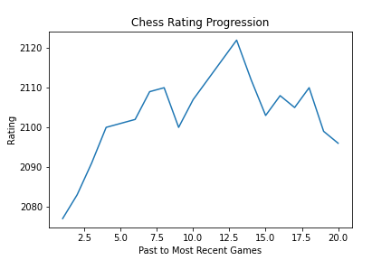

<h1>Welcome to my Chess Analysis</h1>

<p1> I start with the code [Scrape_Chess](scrape_chess.py.ipynb).   This code scrapes the chess.com site to pull the most recent game data directly from the html. Afterwards, I graph the result to show my progression in the last twenty games.</p1>
  
 

<p1> Next, open [Creating the Master DF](creating_the_master_df.iypnb). Here I make a series of API calls to the chess.com website. I input the username, and get a list of archived months in url format. This list contains every month I've played a chess game on chess.com.</p1>
  
<p1> Then I use the list of archived months, to loop through the master archive to collect the games. This came in a complex, unsegmented json response. You can see my code used to parse through the json response for the appropriate data and format. I then combined the revelant information into a single dataframe, with each row representing all the information per single game.</p1>

<p1> The information I collected in the dataframe includes: </p1>
  
<h4> * Date, and Time of Day played </h4>
 <h4> * White player name, White Rating, and White Result, </h4>
 <h4> * Black Name, Black Rating, and Black Result, </h4>
<h4>  * Eco Name (refers to the opening moves), and Eco Code (same), </h4>
 <h4>  * URL, and PGN score (chess notation). </h4>

<p1> I saved this created dataframe to [Master_DF](csv_files/master_df.csv). <p1>
<p1> From there, I transferred the data to Postgres//Sql to query the data. First I created the table, and then imported the data. In SQL, I can make complicated queries to find out trends from the entire database of chessgames. Some questions I want to answer are; do I play better during certain parts of the day? Do I have certain openings that I play better against? And I would like to graph various results as well. </p1>

<p1> Last but not least, and still to be done, I want to link a chess engine computer to python within jupyter notebook, and analyze every single move I've played. Part of the data cleaning process was getting the PGN score into a computer readable format. With the chess engine, I can find further answers to my skill. </p1>
