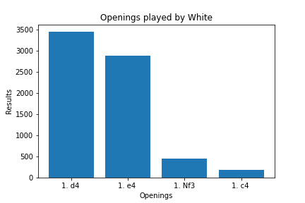

# Welcome to my Chess Analysis

You can run this code to get user chess information from chess.com, and automatically print out relevant graph to visualize the user's data.

By running all cells in "chess_df_and_graphs.ipynb, you are prompted to input the username. Please make sure to make your own config.py file with the same format; login = ("username:password). After several moments, the relevant graphs save to graphs/{username}. The created dataframe saves to csv_files/{username}.csv.  

<p1> The graphs show several points of analysis. I segment the chess games by win/draw/loss by time of day. There is a graph for rating progression over time, overlayed with time controls. I show time of day played, over time. And I show results by opening choices, both for white and black. </p1>

## Here are some graphs

#### Chess results by time of day

#### Jsteele619 as white first move

  
## Technical Explanation

<p1> Python makes a series of API calls to the chess.com website with the username. The code receives a list of archived months in url format. This list contains every month the user has played a chess game on chess.com.</p1>
  
<p1> The list of archived months is used to loop through the master archive to collect the games. This came in a complex, unsegmented json response (actually a tab delimited dataset). I wrote the code to parse through the json response for the appropriate data and format. I then combined the revelant information into a single dataframe, with each row representing all the information per single game.</p1>

<p1> From there, the data transfers to Postgres/Sql to query the data. In SQL, I can make the relevant queries to get the correct data format to be able to graph. Some of the questions I asked are, what time of day is the user more or less successful? What openings does the user play? How much success does the user have with each opening?</p1>
 
## The information I collected in the dataframe includes: 
  
< * Date, and Time of Day played
< * White Player Name, White Rating, and White Result
< * Black Name, Black Rating, and Black Result
< * Eco Name (refers to the opening moves), and Eco Code (same)
< * URL, and PGN score (chess notation)
 
<p1> Still to be done, I want to link a chess engine computer to python within jupyter notebook, to analyze moves played. </p1>
